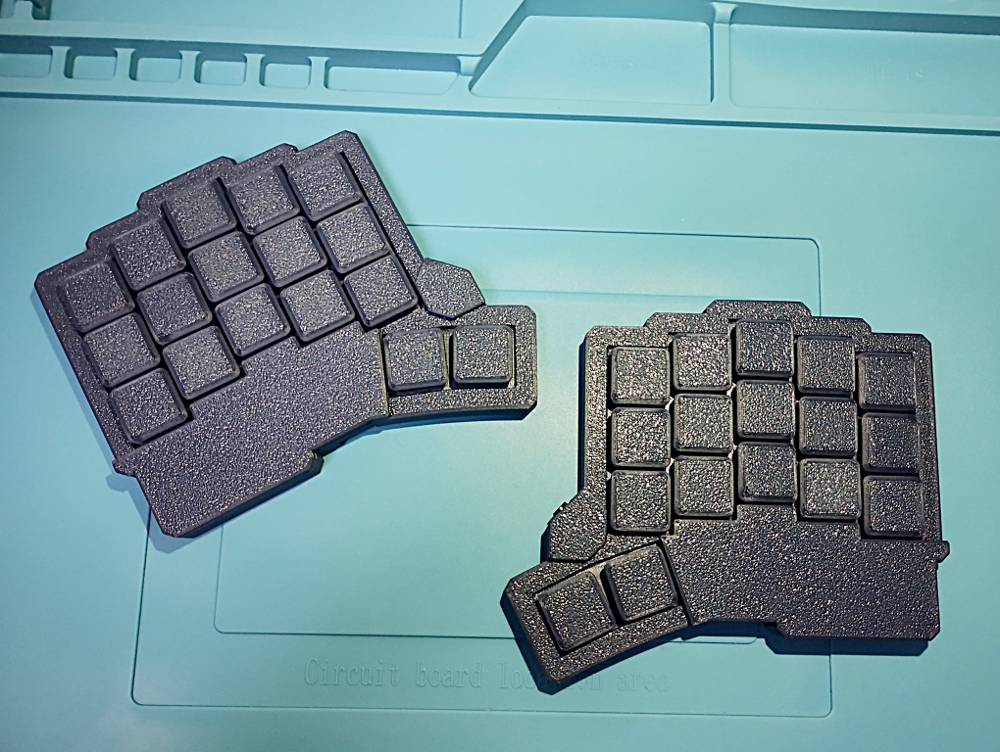

# Palmbrain

Palmbrain(パームブレイン)は17mm(0.9u)の狭ピッチを採用した34キーで分割型のキーボードです。

[miniDivide](https://github.com/takashicompany/minidivide)や[Palmslave](https://github.com/takashicompany/palmslave)のような0.8uと通常の1uサイズとのちょうど中間にあたるサイズ感の機種となります。　

これまでの0.8u機種と同様、小さく薄いため持ち運びやすく、スマートフォンやタブレットとの相性は変わらず抜群です。　

デスクの占有スペースも比較的小さくて済むので、普段遣いにも適しています。　

また、これまでの0.8u機種と比べるとキーの間隔が少し広がっているため、miniDivideやPalmslaveでは手のサイズが合わなかった方でも狭ピッチの良さを感じられることができるかもしれません。　

キースイッチはChoc v1とChoc v2に対応しています。

オプションでBLE Micro Proとコイン電池を搭載可能なため、PC・スマートフォン・タブレットへBluetoothでの接続が可能です。

# 部品

## キットに含まれているもの

|部品|個数|備考|
|:--|:--|:--|
|PCB|2||
|~~[ダイオード(表面実装型)](https://shop.yushakobo.jp/collections/all-keyboard-parts/products/a0800di-02-100)~~|~~32~~|Palmbrainはダイオード不要です。|
|[タクトスイッチ](https://shop.yushakobo.jp/products/a0800ts-01-1)|2|miniDivideやPalmslaveと型が異なります。
|[TRRSソケット](https://shop.yushakobo.jp/products/a0800tr-01-1?_pos=1&_sid=6aacd8367&_ss=r)|2||
|ゴム足シール|8||
|ネジ(M2 8mm)|22||

### 3Dプリントケース

データは[こちら](./case/3d-print)です。

|部品|個数|備考|
|:--|:--|:--|
|スイッチプレート(トッププレート)|2||
|ボトムプレート|2||
|MCUカバー(Pro Microプレート)|2||

## ご自身で用意いただくもの

### 部品

|部品|個数|備考|
|:--|:--|:--|
|[キースイッチ](https://shop.yushakobo.jp/collections/all-switches/products/)|34|Choc v1、v2に対応しています。Lofreeのキースイッチにも対応しています。|
|0.9uキーキャップ(17mm)|34|※[下記](https://github.com/takashicompany/palmbrain/tree/master?tab=readme-ov-file#%E3%82%AD%E3%83%BC%E3%82%AD%E3%83%A3%E3%83%83%E3%83%97)参照|
|[Pro Micro](https://shop.yushakobo.jp/products/3905)|2|動作確認済みのものは[こちら](https://shop.yushakobo.jp/products/3905)です。高さがあるPro Micro(USB-C採用をしたものなど)はPro Microカバーと干渉してしまうことがあります。背の低いPro Microを選択するかスペーサーを長いものに取り替えるなどで対応できます。また、USB-B採用のものはモゲ防止にエポキシ接着剤で補強等の対策を推奨します（[こちら](https://1-4nomiya.hatenablog.com/entry/2019/01/27/164414)を参考ください）。|
|[コンスルー](https://shop.yushakobo.jp/products/31)|4|12ピンのものを購入しておけばPro Micro、BLE Micro Proの両方に用いることができます。|
|[TRRSケーブル](https://shop.yushakobo.jp/products/8023)|1|有線接続の際に左右のキーボードを接続します。**ケーブルが太いものはケースと干渉してしまうことがありますので、左右接続を有線で行う場合は[細身のケーブル](https://shop.yushakobo.jp/products/8023)をご利用ください。**|

### キーキャップ

キーキャップは0.9uピッチ(17mm未満)に対応したものをご利用ください。

[こちらの記事](https://e3w2q.github.io/10/)を参考にするとより良いかと思います。

### 無線化をする場合

|部品|個数|備考|
|:--|:--|:--|
|[BLE Micro Pro](https://shop.yushakobo.jp/products/ble-micro-pro)|2|Pro Microの代わりに取り付けることでBluetooth接続が可能。|
|[チップ積層セラミックコンデンサー](https://akizukidenshi.com/catalog/g/g106041/)|2|BLE Micro Proでの無線化の際に使用。|
|[電源スイッチ(MK12C02)](https://ja.aliexpress.com/item/32798526843.html)|2|BLE Micro Proでの無線化の際に使用。|
|[HU1632](https://www.monotaro.com/p/8835/2765/)|2|BLE Micro Proでの無線化の際に使用。|

## 組み立て方

**組み立てる前に、全ての工程に一度目を通し、頭の中で組み立てるイメージをすると失敗が少なくスムーズに作業が進められます。**

**また、封入されている基盤はリバーシブルのため、左右・裏表がわからなくなってしまうことがありえます。片方ずつ作成すると比較的失敗を回避して組み立て作業ができます。以降の説明は基本的に左手側の組み立て写真を用いて説明しています。**

### 1. PCB裏表と左右を確認する。

キット外観

基板はリバーシブル構造となっており、左手側の表は右手側の裏面となります。はじめに、プレートを取り外して基板を取り出したあとに、左右を混同しないようにマスキングテープなどで表面に目印を付けておくことを推奨します。

また、片手ずつ組み立てていくとミスを減らすことができます。

左手キット外観と分解後

 

**以降の説明は基本的に左手側の組み立てを説明します。基板が裏表逆である以外は、後述のMCUの裏表の向きが逆である他は全て同じ手順になります。**

### 2. リセットスイッチの取り付け

リセットスイッチとして、タクトスイッチを基板に取り付けます。リセットスイッチはMCUにファームウェアを書き込む際に利用します。

リセットスイッチをつけなくても、ピンセット等で導通させることで動作させられます。

リセットスイッチの取り付け箇所は基板の**表側**になります。

**miniDivideやPalmbrainは裏面取り付けだったので、向きに特に注意！**

タクトスイッチを基板の**表側**に載せます。

基板を裏返してタクトスイッチの足が基板裏面から出ていることを確認します。

基板とタクトスイッチの足をハンダ付けします。

### 3. Pro Microの取り付け

MCU(Micro Controller Unit)として、Pro Microを取り付けます。MCUは主にキーボードの入力をPCなどの外部デバイスに伝達します。

PalmbrainはBLE Micro Proを用いた無線化に対応していますが、動作が正しくない場合のトラブルシューティングの観点から、最初はPro Microによる有線接続で組み立てることを推奨します。

Pro Micro(BLE Micro Pro)を基板に取り付ける際は[コンスルー](https://shop.yushakobo.jp/products/31)を使用することを強く推奨します。コンスルーを用いることでMCUが故障した際の交換が容易になります。また、Pro Microを用いて組み立てた後にBLE Micro Proへ移行する際の移行も容易になります。

コンスルーを基板の**表側**に挿します。この際にハンダ付けはしないでください。Pro Microを挿す場合は基板の端側のBATとGNDのピン穴は空けておきます。

また、コンスルーには向きがあります。コンスルーをよく見ると穴が空いていますが、穴は中心ではなく、片側に寄っています。穴が空いている側にMCU、穴が空いていない側にPalmbrainの基板が来るように差し込んでください。

コンスルーにPro Microを載せます。コンスルーを載せる際には基板のピンの印字と、Pro Microのピンの印字が合致することを確認してください。

**左手側と右手側でPro Microの裏表が異なります。** [こちらのPro Micro](https://shop.yushakobo.jp/products/pro-micro)では**左手側の場合はPro Microの部品がPalmbrainの基板側に来るように配置します。**

**右手側の場合はPro Microの部品が表側になるように配置します。**

コンスルーとPro Microをハンダ付けします。Pro Microによってはハンダ付けをせずに導通できるものもあります。BLE Micro Proの場合も同様です。

右手側も同様の手順で取り付けます。先述した通り右手側はPro Microの裏表が逆になります。

### 4. TRRSソケットの取り付け

左右のキーボードをTRRSケーブルで接続する際のTRRSソケットを取り付けます。

TRRSソケットを基板の表側に載せます。

基板を裏返してTRRSソケットの足が基板裏面から出ていることを確認します。4つの足が出ている状態が正しいです。

基板とTRRSソケットの足をハンダ付けします。

### 5. ファームウェアの書き込み

2025/01/12時点では[miniDivide(v1)のファームウェア](https://github.com/takashicompany/minidivide?tab=readme-ov-file#6-%E3%83%95%E3%82%A1%E3%83%BC%E3%83%A0%E3%82%A6%E3%82%A7%E3%82%A2%E3%81%AE%E6%9B%B8%E3%81%8D%E8%BE%BC%E3%81%BF)をご利用ください。

書き込み手順や確認事項も同様となります。

Pro Microにファームウェアを書き込みます。ファームウェアは[Remapから書き込む](https://remap-keys.app/catalog/9hMciuSoDHS5Mp3YbabX/firmware)ことができます。

Remapでのファームウェア書き込みは[こちら](https://docs.dailycraft.jp/buildguides/firmware/remap.html)を参照すると手順が分かりやすいかと思います。

Remapの使い方は[こちら](https://salicylic-acid3.hatenablog.com/entry/remap-manual)を参照するのが分かりやすいかと思います。

RemapでMCU(Pro Micro)が正しく動作するかを確認できます。USBでPCに接続しRemapを開いた後に、右下の3点リーダからTest Matrix modeを選択してください。

金属製のピンセットなどで赤丸の箇所を通電させることで擬似的にキースイッチの入力を再現できます。

全てのキースイッチが点灯するかを確認します。なお、ファームウェアは左手側をUSBとして接続することを前提としているので、片手側のみを接続した場合は左手側が点灯します。

もし点灯しないキーがあった場合はキースイッチのハンダ付けを再度行うと改善することがあるかと思います。

### 6. 無線化用の部品の取り付け

この項目は**Pro Microでの有線接続で左右のキーボード全てのキーの入力が確認できた後に実施することを推奨**します。

無線化自体は組み立てが終わった後でも実施可能ですので、後回しにしてもOKです。

後回しでもOKですが、基板とスイッチプレートを取り付けてからのハンダ付けはスイッチプレートが邪魔になってしまうため、将来的に無線化したい場合は7の前に実施することを推奨します。

チップ積層セラミックコンデンサーを取り出します。

取り付け箇所は、**基板裏面**のコイン電池ホルダー部になります。

チップ積層セラミックコンデンサーはタクトスイッチやTRRSソケットとは異なり足が無いので、取り付け箇所の片側に予備ハンダを行います。

ピンセットでコンデンサーを掴みながら予備ハンダを溶かしつつ片側をハンダ付けします。

コンデンサーのもう片側もハンダ付けを行います。

予備ハンダ側はハンダに含まれる松やにが揮発していることが多いので、フラックスを塗って再度ハンダこてで加熱することで、基板とコンデンサーの密着性が向上します。

電源スイッチを取り出します。取り付け箇所は取り付け箇所は**基板裏面**のコイン電池ホルダー部、チップ積層セラミックコンデンサーの近くになります。

電源スイッチの足と基板のハンダ付け箇所が合うように載せます。

電源スイッチの足と基板をハンダ付けします。

コイン電池ホルダーを取り付けます。取り付け箇所は**基板の表側**、Pro Microとリセットスイッチの隣です。

コイン電池ホルダーの足が基板に通るように穴を確認しながら挿します。

基板の裏面からホルダーの足が出ていることを確認します。基板を裏返した際にホルダーが抜け落ちてしまう場合はマスキングテープなどで固定すると作業がスムーズに進められます。赤丸の位置からホルダーの足が出ていることが確認できたら足と基板をハンダ付けします。

コイン電池ホルダーにCR1632を入れます。また、Pro Microと同様にBLE Micro Proを取り付けます。

Pro Microは片側12ピンですが、BLE Micro Proは13ピンとなります。12ピンのコンスルーのみお持ちの方はBATの穴にコンスルーのピンが来るように挿してください。

また、[13ピンのコンスルー](https://shop.yushakobo.jp/products/31?variant=37665714438305)も取り扱いがありますので、こちらを利用することを推奨します。

BLE Micro Proの設定手順は[こちら](https://sekigon-gonnoc.github.io/BLE-Micro-Pro/#/getting_started?id=ble-micro-pro-web-configurator%e3%82%92%e4%bd%bf%e3%81%a3%e3%81%a6%e3%83%95%e3%82%a1%e3%83%bc%e3%83%a0%e3%82%a6%e3%82%a7%e3%82%a2%e3%82%92%e6%9b%b8%e3%81%8d%e8%be%bc%e3%82%80)を参考に進めてください。

### 7. ケースとキースイッチの取り付け

以降は左手側での組み立て説明です。右手側も手順は同様です。

2025/8/1現在アクリルプレートの取り扱いがないため、3Dプリントケースの組み方の説明のみとなります。

#### 3Dプリントケース

スイッチプレートを用意します。

スイッチプレートと基板をキースイッチで固定します。

キースイッチを4-5個程度スイッチプレートに挿します。パチンと音がするまでしっかり挿し込みます。

表側

裏側

スイッチプレートを裏向きにして基板を載せて、先ほど挿したキースイッチの足が基板の裏側から出るように挿し込みます。

基板の裏側から全てのキースイッチの足が出ていることを確認します。

キースイッチの足と基板をハンダ付けします。キースイッチと基板をハンダ付けすることで、キースイッチと基板でスイッチプレートを固定します。

残り全てのキースイッチ(片手側で17個、両手合わせて34個)を取り付けてハンダ付けします。

Pro Microカバーを取り出します。

スイッチプレートとPro Microカバーを重ね合わせます。

ネジをスイッチプレートの裏面から3箇所挿し込み、ネジを留めます。

TRRSソケットカバーを取り出します。

スイッチプレートとTRRSソケットカバーを重ね合わせます。

ネジをスイッチプレートの裏面から2箇所挿し込み、ネジを留めます。

ボトムプレートを取り出します。

スイッチプレート(と基板)にボトムプレートをはめ込みます。

ネジをボトムプレートの裏面からネジ穴に挿します。

### 8. ゴム足シールの取付け

ケースの底面に滑り止めとしてゴム足シールを貼り付けます。

打鍵スタイルにあわせてお好みの位置に貼り付けてください。

### 9. キーキャップの取り付け

キースイッチにキーキャップを取付けて完成です。

### 10. 完成した後の楽しみ方

完成しましたら、ぜひSNSなどに写真を投稿頂ければと思います。

Twitterのハッシュタグは [`#Palmbrain #自作キーボード`](https://twitter.com/search?q=%23%E8%87%AA%E4%BD%9C%E3%82%AD%E3%83%BC%E3%83%9C%E3%83%BC%E3%83%89%20%23Palmbrain&src=typed_query) を付けていただけると幸いです。

キットを組み立てた感想や、キーボードを使った所感などをお待ちしております！
